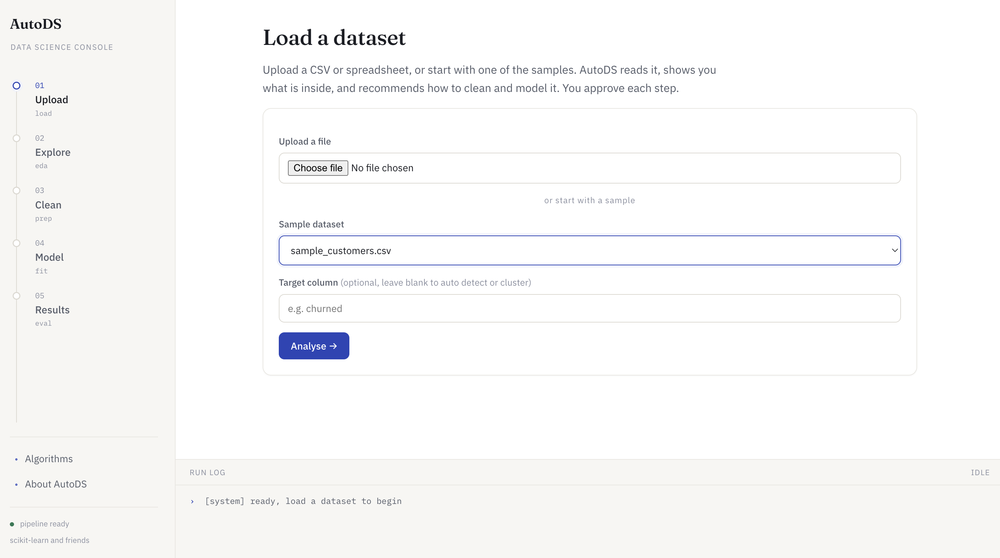
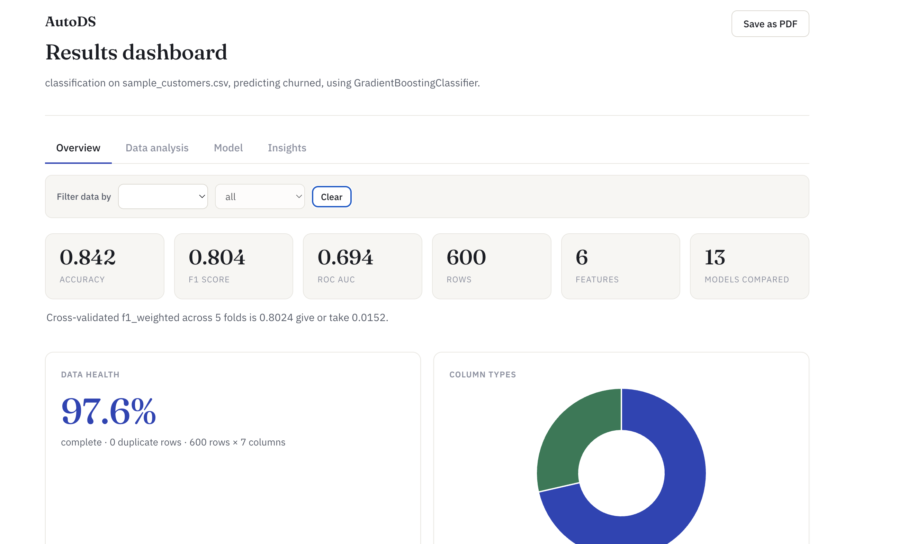
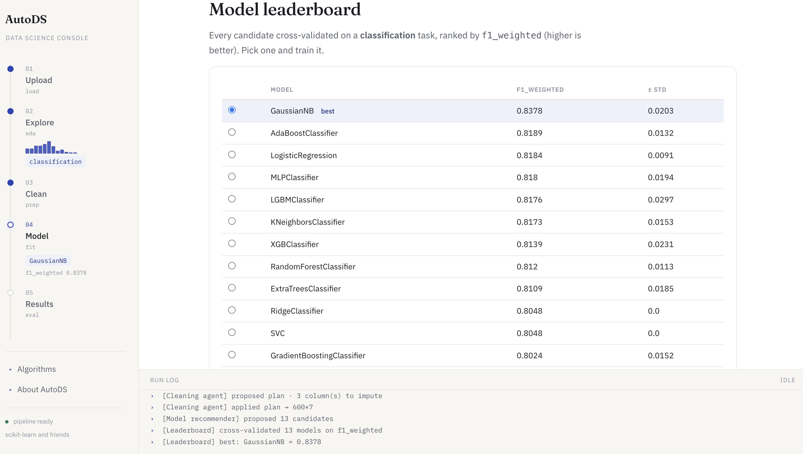
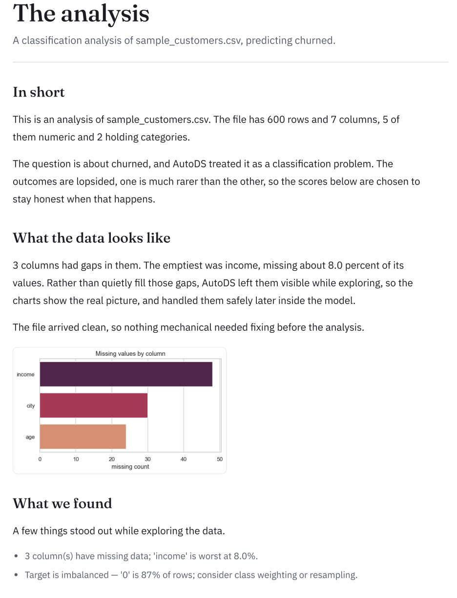

# AutoDS Copilot

An AI data-science assistant. Point it at a spreadsheet and it walks the whole
machine-learning workflow for you, exploring the data, cleaning it, comparing
dozens of models, training the best one, and explaining the result in plain
language. It runs locally, and the same engine is exposed three ways: a web
console, an autonomous agent, and a set of tools any AI client can call.

No notebooks, no setup. Upload a CSV and you get a trained model, an interactive
dashboard, a written analysis, and the ability to score new data.

## Screenshots

The web console walks the whole workflow, from an uploaded CSV to a trained model.



The interactive dashboard, with Overview, Data analysis, Model, and Insights tabs.



The cross-validated model leaderboard, every candidate ranked on your data.



The self-writing analysis report, the signature output.



---

## What it does

It runs the full lifecycle and pauses for your approval at the decisions that matter.

1. **Load** a CSV, Excel, TSV, or JSON file.
2. **Pre-clean**, a light mechanical pass that fixes representation only, trims
   whitespace, turns placeholder tokens into real missing values, parses dates
   stored as text, converts numeric text, and drops duplicate rows. Every change
   is logged. It never imputes or removes outliers, so exploration stays honest.
3. **Explore** with a varied set of seaborn charts, each with the code behind it
   and a plain-language reading.
4. **Data checks** flag the silent mistakes before you model, target leakage,
   constant or ID-like columns, duplicates, high cardinality, and outliers.
5. **Detect the task** on its own, classification, regression, clustering, time
   series, or text.
6. **Recommend cleaning** and wait for your approval.
7. **Compare models** on a cross-validated leaderboard, or build an **ensemble**
   of the best ones.
8. **Train and evaluate** with task-appropriate metrics, diagnostic plots,
   feature importance, and honest cross-validation.
9. **Tune** the winner, which actually retrains and keeps the improved model.
10. **Explain**, a self-written analysis report and an interactive dashboard.
11. **Use it**, score new data, download predictions as CSV, or export the model
    as a bundle with a ready-to-run code snippet.

## The algorithm hub

Thirty-two models built in, and thirty-six with the optional boosting libraries.

- **Classification** (11): Logistic Regression, Ridge, Naive Bayes, KNN,
  Decision Tree, Random Forest, Extra Trees, AdaBoost, Gradient Boosting, SVM, MLP.
- **Regression** (12): Linear, Ridge, Lasso, ElasticNet, KNN, Decision Tree,
  Random Forest, Extra Trees, AdaBoost, Gradient Boosting, SVR, MLP.
- **Clustering** (9): KMeans, MiniBatchKMeans, Agglomerative, Spectral, Birch,
  Gaussian Mixture, DBSCAN, MeanShift, OPTICS.
- **XGBoost and LightGBM** join automatically when installed.
- Time series reuses the regression models on lag and calendar features; text
  reuses the classification models on TF-IDF.

For any supervised task it cross-validates every candidate, ranks them, tunes the
winner, ensembles the best, and exports the fitted pipeline.

## RAG, the reasoning layer

- A curated **knowledge base** of data-science guidance, retrieved to ground the
  insights, with the source cited.
- **Experience retrieval**, every run is fingerprinted, and new runs retrieve the
  most similar past datasets to recommend by analogy. The tool learns from use.
- **RAG-driven recommendations**, the cleaning and model choices are justified
  with retrieved guidance.
- A grounded **Ask panel**, ask any question and get an answer built only from
  retrieved material, with the sources shown.

## Three ways to run it

```bash
cd AutoDS_Copilot
python3 -m pip install -r requirements.txt

# 1. Web console  ->  open http://127.0.0.1:5050
python3 run.py

# 2. Autonomous agent (LangGraph, human-in-the-loop from the terminal)
python3 -m autods.agents.graph data/sample_customers.csv --target churned
python3 -m autods.agents.graph data/sample_customers.csv --target churned --auto

# 3. MCP server (drive it from any MCP client, e.g. Claude Desktop)
python3 -m autods.mcp_server
```

Bundled sample datasets: `sample_customers.csv` (classification / regression),
`sample_timeseries.csv` (forecasting), `sample_reviews.csv` (text),
`sample_imbalanced.csv` (rare-class classification).

Note on the port: 5050 is used because macOS AirPlay Receiver occupies 5000.
Override with `PORT=8000 python3 run.py`.

## Tests

An offline pytest suite covers the engine, the leakage-safe pipeline, task
detection, the quality guardrails, the leaderboard, the RAG retriever, and the
agent graph. It needs no API key.

```bash
python3 -m pip install pytest
python3 -m pytest -q
```

## Where each skill lives

| Skill | Where | What it does |
|---|---|---|
| **RAG** | `rag/` | TF-IDF vector store over a knowledge base and run memory, with citations, experience retrieval, and grounded answering. |
| **LangGraph** | `agents/graph.py` | A stateful graph that runs the stages as agents with human-in-the-loop interrupts and resume. |
| **Multi-agent** | `agents/graph.py` | Specialised nodes, Loader, Profiler, EDA, Task-detector, Cleaning, Model-recommender, Trainer, Evaluator, Insight. |
| **MCP** | `mcp_server.py` | Nine tools exposing the pipeline, packaged as an installable plugin. |
| **scikit-learn** | `pipeline/` | The engine, a leakage-safe pipeline, the model hub, evaluation, tuning, ensembles. |

### Connect the MCP server to Claude Desktop

See `MCP_SETUP.md`. In short, install the requirements, add the block from
`mcp_config.example.json` to your Claude Desktop config, and restart.

## Project layout

```
AutoDS_Copilot/
├── run.py                  # launch the web app
├── mcp_launch.py           # launch the MCP server
├── autods/
│   ├── config.py
│   ├── pipeline/           # the ML engine
│   │   ├── loader.py       preclean.py   task_detect.py  eda.py
│   │   ├── quality.py      preprocess.py model_select.py train.py
│   │   ├── evaluate.py     leaderboard.py insights.py    report.py
│   ├── rag/                # knowledge base + retrieval + experience + ask
│   ├── agents/             # LangGraph orchestration
│   ├── mcp_server.py       # MCP tools
│   └── web/                # Flask console, dashboard, report, api
└── data/                   # sample datasets
```

## Design decisions worth knowing

- **No data leakage.** All preprocessing lives inside an sklearn Pipeline fit only
  on the training split.
- **Human-in-the-loop.** The tool recommends, you approve, at cleaning and model
  choice.
- **Trustworthy evaluation.** Cross-validation on the final model, and tuning that
  actually retrains and replaces the model.
- **Grounded, not hallucinated.** Insights, answers, and recommendation rationale
  are written from retrieved knowledge and the run's real numbers, never invented.
  Everything works with zero API keys because the LLM step is optional.

### Turning on the LLM copilot

By default the copilot writes solid rule-based text and needs no key. Point it at
a model and the same outputs become richer, fuller prose, still grounded strictly
in the retrieved notes and the run's verified facts. It is provider-agnostic, set
one of these (copy `.env.example` to `.env`, which is gitignored so keys never get
committed):

- `OPENAI_API_KEY` for OpenAI, or `ANTHROPIC_API_KEY` for Claude
- a local [Ollama](https://ollama.com) server for a free, offline model

Force a provider or model with `AUTODS_LLM_PROVIDER` and `AUTODS_LLM_MODEL`;
otherwise it auto-detects whichever key is present. If a model is unavailable or
errors, it silently falls back to the rule-based text.
- **Time series done right.** The differenced target plus lag and calendar
  features, and a time-ordered split.

## Requirements

Python 3.10+, pandas, numpy, scikit-learn, matplotlib, seaborn, joblib, Flask,
langgraph, mcp. Optional: xgboost, lightgbm, and an LLM provider (OpenAI,
Anthropic, or local Ollama) for richer, grounded wording.
